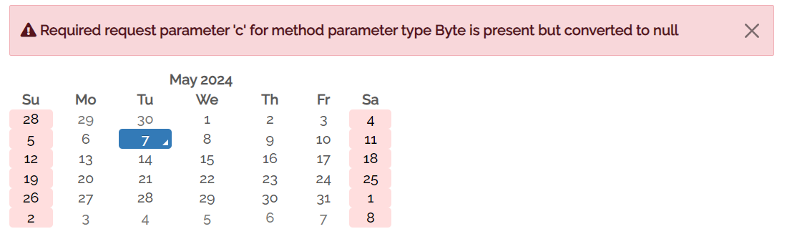

# Usabilidades heurísticas

---

  
1 - Visibilidade dos status do sistema

  

  
2 - Correspondência entre o sistema e o mundo real

  

  
3 - Controle e liberdade do usuário

  

  
4 - Consistência e Padrões

  

  
5 - Prevenção de erros

  

  
6 - Reconhecimento em vez de lembrança

  

  
7 - Flexibilidade e eficiência de uso

  

  
8 - Design Estético e Minimalista

  

  
9 - Ajude os usuários a reconhecer, diagnosticar e se recuperar de erros

  

  
10 - Ajuda e Documentação

  

